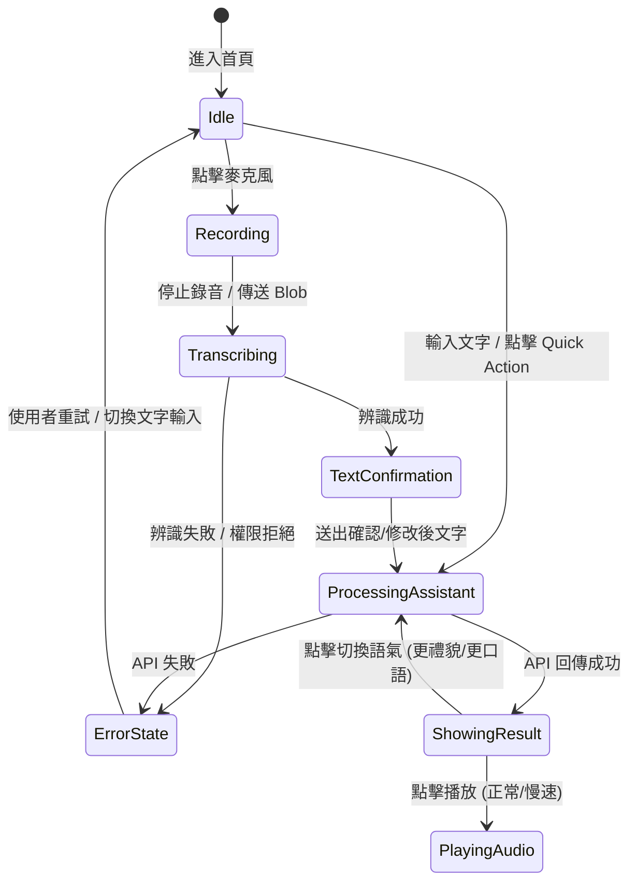

# Data Model & Interfaces: Tokyo Mate 東京通

**Feature Branch**: `001-tokyo-travel-assistant`  
**Date**: 2026-09-12  
**Status**: Draft  

---

## 概述

本文件定義 Tokyo Mate 前後端溝通、資料處理與 UI 狀態管理所使用的 core data models、TypeScript interfaces、驗證規則與狀態轉移模型。
所有型別均遵循不洩漏 external provider raw response（如 OpenAI, Google Places）的原則，前端僅依賴定義良好的內部型別。

---

## 1. 核心 Data Entities 與 TypeScript 型別

### 1.1 UserRequest（使用者請求）

代表使用者輸入的一次操作（文字、語音或導覽點擊）。

```typescript
export type InputType = 'text' | 'voice' | 'quick_action';

export type UserTone = 'default' | 'polite' | 'casual';

export interface LocationCoordinates {
  latitude: number;
  longitude: number;
}

export interface UserLocation {
  type: 'coordinates' | 'manual';
  coordinates?: LocationCoordinates;
  manualArea?: string; // e.g. "新宿", "淺草"
}

export interface UserRequest {
  id: string;                      // UUID or timestamp string
  text: string;                    // 使用者輸入的文字或語音辨識修正後的文字
  inputType: InputType;            // 輸入方式
  tone?: UserTone;                  // 要求的語氣，預設 default (自然禮貌)
  location?: UserLocation;          // 可選的位置資訊
  context?: {                      // 可選的互動上下文
    previousIntent?: string;
    currentArea?: string;
  };
}
```

---

### 1.2 決策維度與 AssistantResult（AI 助手回應結構）

系統採用兩個獨立且正交的決策維度：
1. **Safety（安全維度）**：`'normal' | 'emergency'`
2. **Freshness（即時性維度）**：`'not_required' | 'live_required' | 'verified' | 'unavailable' | 'uncertain'`

兩者可同時成立（例如護照遺失為 `emergency` + `live_required`；JR 延誤為 `normal` + `live_required`），嚴禁合併為單一模式。

```typescript
export type SafetyLevel = 'normal' | 'emergency';

export type FreshnessLevel = 'not_required' | 'live_required' | 'verified' | 'unavailable' | 'uncertain';

export type RequestIntent = 'translation' | 'travel' | 'nearby' | 'knowledge' | 'emergency';

export type AnswerType = 'direct_translation' | 'action_plan' | 'place_recommendation' | 'knowledge_summary' | 'emergency_guide';

export type LiveDataStatus = FreshnessLevel;

export interface SuggestedAction {
  id: string;
  label: string;                   // e.g. "更禮貌", "播放語音", "怎麼去", "附近美食"
  actionType: 'adjust_tone' | 'tts' | 'navigate' | 'search_nearby' | 'view_knowledge';
  payload?: Record<string, unknown>;
}

/**
 * 最小旅遊回答契約 (General Travel / Knowledge)
 * 順序：conclusion -> action -> optional caution -> optional phrase
 * 「必要日文」只有在對現場行動有幫助時才需要，不要求所有問答固定產生日文。
 */
export interface TravelAnswerStructure {
  conclusion: string;              // 結論 / 最推薦
  action: string | string[];       // 建議步驟 / 怎麼做
  caution?: string[];              // 注意事項（可選）
  phrase?: {                       // 現場實用日文（可選，僅在對行動有幫助時提供）
    japanese: string;
    pronunciation?: string;
    meaning?: string;
  };
}

/**
 * 最小緊急指引契約 (Emergency)
 * 順序：immediateAction -> nextAction -> optional phrase -> optional importantNotice
 */
export interface EmergencyGuideStructure {
  immediateAction: string[];       // 現在先做（立即安全行動）
  nextAction: string[];            // 接著行動（正式求助/後續步驟）
  phrase?: string[];               // 現場應對實用日文（可選）
  importantNotice?: string;        // 重要提醒 / 官方聯絡電話（可選）
}

export interface AssistantResult {
  id: string;
  safety: SafetyLevel;             // Canonical 安全決策來源（依 FR-016），emergency 為其衍生值
  freshness: FreshnessLevel;       // Canonical 即時性決策來源（依 FR-015），liveDataStatus 為其對外表示
  intent: RequestIntent;
  sourceLanguage: 'zh-TW' | 'ja' | 'other';
  targetLanguage?: 'zh-TW' | 'ja';
  answerType: AnswerType;
  primaryContent: string;           // 主要回答文字（繁體中文或日文）
  translation?: {                   // 若有翻譯對照時提供
    sourceText: string;
    targetText: string;
    pronunciation?: string;         // 假名/羅馬拼音（若有）
    toneUsed: UserTone;
  };
  travelAnswer?: TravelAnswerStructure;         // 最小一般旅遊回答結構
  liveDataStatus: LiveDataStatus;               // Freshness decision 的對外表示，不得與 freshness 獨立設定成矛盾值
  liveDataMessage?: string;                     // 即時資訊說明
  liveDataNextAction?: string;                  // 即時資料後續建議
  suggestedActions: SuggestedAction[];
  emergency: boolean;                          // 衍生值：emergency = (safety === 'emergency')，不得獨立設定成矛盾值
  emergencyGuide?: EmergencyGuideStructure;     // 最小緊急指引結構
}
```

> **Canonical 判斷來源與對外表示**：
> - **Safety**（依 FR-016）為 canonical 決策來源；`emergency` 為其在 `AssistantResult` response contract 中的對外衍生值，定義為 `emergency = (safety === 'emergency')`，不得獨立設定成與 `safety` 矛盾的值。
> - **Freshness**（依 FR-015）為 canonical 決策來源；`liveDataStatus`（`type LiveDataStatus = FreshnessLevel`）為 Freshness decision 在 `AssistantResult` response contract 中的對外表示，不得與 canonical Freshness decision（`freshness` 欄位）獨立設定成矛盾值。

---

### 1.3 KnowledgeEntry（東京知識庫項目）

存放於 `src/data/tokyo/*.json` 的結構化知識條目。

```typescript
export type KnowledgeCategory = 'area' | 'transport' | 'food' | 'shopping' | 'culture' | 'emergency';

export interface KnowledgeEntry {
  id: string;                       // e.g. "area-shinjuku"
  category: KnowledgeCategory;     // 分類
  area?: string;                    // e.g. "shinjuku", "asakusa"
  title: string;                    // 標題，如 "新宿區域指南"
  summary: string;                  // 摘要（一句話結論）
  content: {
    recommendedFor?: string[];     // 適合族群
    highlights?: string[];          // 主要特色
    howToExplore?: string[];        // 怎麼逛/建議玩法
    mustTryOrBuy?: string[];        // 美食/購物推薦
    transportTips?: string[];       // 交通省時建議
    stayDuration?: string;          // 建議停留時間
    dayNightDifference?: string;    // 白天/晚上差異
    importantNotes?: string[];      // 注意事項
    practicalJapanese?: Array<{     // 實用日文
      japanese: string;
      meaning: string;
    }>;
  };
  tags: string[];                   // e.g. ["燒肉", "百貨", "深夜", "轉乘"]
  updatedAt: string;                // YYYY-MM-DD
}
```

---

### 1.4 PlaceResult（地點搜尋結果）

由 `/api/places` 回傳的地點卡片結構。

```typescript
export interface PlaceResult {
  id: string;                       // Google Place ID
  name: string;                     // 店家/景點名稱 (e.g. "一蘭拉麵 新宿中央東口店")
  category: string;                 // e.g. "拉麵", "百貨", "便利商店"
  address: string;                  // 地址
  location: LocationCoordinates;
  distanceMeter?: number;           // 距離（公尺，依目前座標計算）
  openNowStatus?: 'open' | 'closed' | 'unknown'; // 營業狀態
  whyRecommended?: string;          // 為什麼適合推薦
}
```

---

### 1.5 Speech & Audio Interfaces（語音與音訊型別）

```typescript
export interface AudioTranscriptionResult {
  text: string;
  detectedLanguage?: string;
}

export interface SpeechGenerationRequest {
  text: string;
  language: 'ja' | 'zh-TW';
  speed: 'normal' | 'slow';         // 1.0x vs 0.75x
}
```

---

### 1.6 ProductError & Status（產品失敗狀態）

```typescript
export type ErrorCode = 
  | 'MIC_PERMISSION_DENIED'
  | 'TRANSCRIPTION_FAILED'
  | 'AI_SERVICE_UNAVAILABLE'
  | 'GEOLOCATION_DENIED'
  | 'GEOLOCATION_UNAVAILABLE'
  | 'PLACES_SERVICE_UNAVAILABLE'
  | 'LIVE_SEARCH_UNAVAILABLE'
  | 'NETWORK_ERROR'
  | 'INVALID_INPUT';

export interface ProductError {
  code: ErrorCode;
  userTitle: string;                // 給使用者的友善標題
  userMessage: string;              // 給使用者的說明
  actionableStep: string;           // 建議採取的下一步 (e.g. "改用文字輸入")
}
```

---

## 2. 欄位驗證規則 (Validation Rules)

### Server-Side Boundary Validation (`/api/*`)

1. **`/api/assistant`**:
   - `text`: 非空字串，長度 1 ~ 1,000 字。過長退回 400。
   - `tone`: 必須為 `'default' | 'polite' | 'casual'` 之一。
   - `location.coordinates`: latitude [-90, 90], longitude [-180, 180]。

2. **`/api/transcribe`**:
   - `audio`: File / Blob 必須存在。
   - 檔案大小: 不可超過 10 MB。
   - MIME Type: 允許 `audio/webm`, `audio/mp4`, `audio/m4a`, `audio/wav`, `audio/aac`, `audio/mpeg`。

3. **`/api/speech`**:
   - `text`: 非空字串，長度限制 <= 500 字。
   - `language`: `'ja' | 'zh-TW'`。
   - `speed`: `'normal' | 'slow'`。

4. **`/api/places`**:
   - 必須提供 `coordinates` (lat, lng) 或 `manualArea` (非空字串)。
   - `query` / `category`: 可選，長度 <= 100 字。

---

## 3. UI & Service 狀態轉移 (State Transitions)



---

## 4. 持久化與隱私策略 (Persistence Rules)

- **Application Database**: 0 (第一版無數據庫)。
- **User Authentication**: 0 (第一版免登入)。
- **Chat History**: 不保留長期的旅行聊天紀錄。當前問答與翻譯僅存在 React component / page local state 中，刷新的頁面即清空。
- **Geolocation**: 僅在每一次性 request 帶至 `/api/places`，完全不寫入 `localStorage` / `sessionStorage` / DB。
